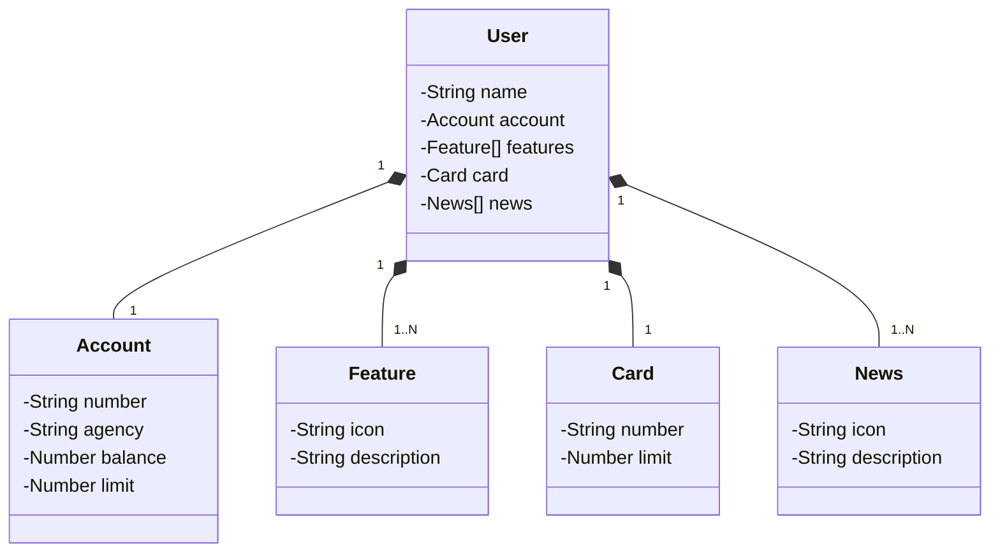

# Bank API Project
Java RESTful API created for practicing.

## Classes Diagram



## Docker Deployment Instructions

### Prerequisites

- Docker installed on your machine
- Docker Compose installed on your machine

### Build and Run Docker Containers

1. Clone the repository:
   ```sh
   git clone https://github.com/aldair-gc/bank-dev.git
   cd bank-dev
   ```

2. Build and run the Docker containers:
   ```sh
   docker-compose up --build
   ```

### Configure Environment Variables for PostgreSQL

The `docker-compose.yml` file sets the following environment variables for the PostgreSQL service:

- `POSTGRES_DB=bank_dev`
- `POSTGRES_USER=bank_dev_user`
- `POSTGRES_PASSWORD=bank_dev_password`

The Java application service uses the following environment variables to connect to the PostgreSQL database:

- `PGHOST=database`
- `PGPORT=5432`
- `PGDATABASE=bank_dev`
- `PGUSER=bank_dev_user`
- `PGPASSWORD=bank_dev_password`

### Access the Application

Once the Docker containers are up and running, you can access the application at:
```
http://localhost:8080
```

## CI/CD Setup Instructions

### Prerequisites

- GitHub account
- Repository on GitHub

### GitHub Actions Configuration

1. Create a directory for GitHub Actions workflows:
   ```sh
   mkdir -p .github/workflows
   ```

2. Create a CI configuration file:
   ```sh
   touch .github/workflows/ci.yml
   ```

3. Add the following content to the `ci.yml` file:
   ```yaml
   name: CI

   on:
     push:
       branches:
         - main
     pull_request:
       branches:
         - main

   jobs:
     build:
       runs-on: ubuntu-latest

       steps:
         - name: Checkout code
           uses: actions/checkout@v2

         - name: Set up JDK 21
           uses: actions/setup-java@v2
           with:
             java-version: '21'

         - name: Build with Gradle
           run: ./gradlew build

         - name: Run tests
           run: ./gradlew test

         - name: Build Docker image
           run: docker-compose build

         - name: Deploy Docker container
           run: docker-compose up -d
   ```
